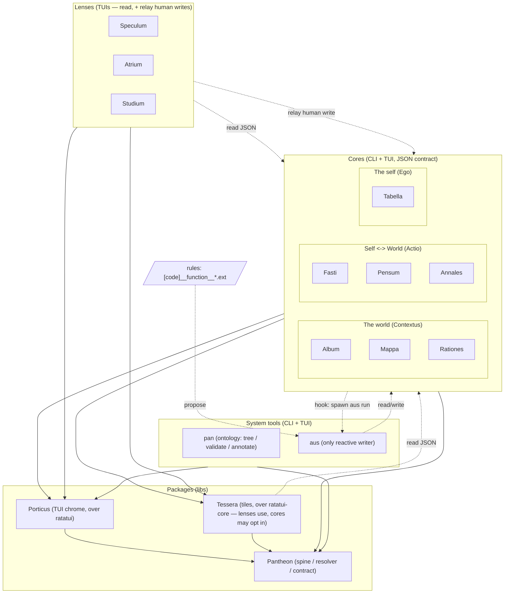

## 4. System architecture

Four layers. The dependency rule (I5): **everything points at Pantheon; nothing points sideways.**

**Read vertically** — the dependency layer. Everything points at the **spine** `pantheon` and nothing points sideways (I5). Above it sit two peer libs — `porticus` (chrome) and `tessera` (tiles) — each over `pantheon` + `ratatui`, neither depending on the other (§11). Above *those*, every instrument is both a CLI that emits JSON (I4) and a Porticus TUI over the same logic: the seven cores, the three lenses, and the two system tools `pan` and `aus` — twelve apps, one look and one keymap (§11.1). A core links `porticus` behind its default `tui` feature (and `tessera` if it drops in a tile of its own readings, §11.2), dropping both for a headless build (§14); `pan` and `aus` live in their own bin crates so the spine lib stays UI-free.

**Read horizontally** — who writes, **CQRS-flavoured**. Recording a reading is the write side (the stored records are the truth); everything else *folds* records into a present (lenses render projections, and never *originate* a write — see I2); Auspex is the one component allowed to turn a read into a write automatically — rule scripts *propose*, only Auspex applies (§9.3). `pan` sits apart from this axis: it never touches `data`, working one layer down on the tree itself — codes, files, refs, node annotations (§10).

Dotted edges are runtime, not link-dependencies: a lens, a tile, or `aus` reaching a core it found on `PATH`, cores finding `aus` the same way, Auspex finding rules by walking the tree. No component links another across a dotted edge (I4/I5); nothing breaks if a core, `aus`, or a rule is absent.
